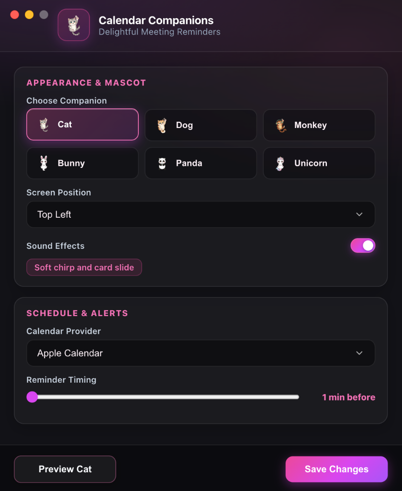

# Calendar Companions

Never miss another meeting. Delightful, impossible-to-ignore desktop reminders brought to life by adorable, Kawaii-inspired animated animal companions for macOS.

Designed by [untamedtinker](https://github.com/untamedtinker).

---

## Table of Contents
- [Project Description](#project-description)
- [Why It Was Created](#why-it-was-created)
- [Tech Stack](#tech-stack)
- [How to Use](#how-to-use)
- [What It Was Tested On](#what-it-was-tested-on)
- [Q&A / FAQ](#qa--faq)
- [License](#license)

---

## Project Description
Say goodbye to boring, easily missed system notifications. Calendar Companions transforms routine calendar alerts into moments of pure delight right on your desktop.

<p align="center">
  
</p>

When an upcoming call is about to start, your favorite cute companion peeks in from the top of your screen with an elegant meeting memo, provides a frictionless 1-click Join button, and playfully rolls a stampede of cheerful companions across your display so you are always on time with a smile.

### Why You Will Love Calendar Companions
- **Choose Your Favorite Companion:** Pick from a lovable cast of 6 characters: Cat, Dog, Monkey, Bunny, Panda, or Unicorn.
- **1-Click Instant Join:** Direct integration detects Google Meet, Zoom, Microsoft Teams, Webex, and FaceTime links so you can jump into calls with a single click.
- **Smart Non-Intrusive Design:** Enjoy seamless mouse click-through that stays completely out of your way while working, with an intuitive hover-pause that gives you plenty of time to view details.
- **Enchanting Procedural Soundscapes:** Experience cute custom audio including soft meows, cheerful puppy barks, relaxing lo-fi synth bells, boba pops, and magical chimes.
- **Universal Calendar Sync:** Effortlessly connects with both Apple Calendar and Google Calendar.
- **Discrete Menu Bar Control:** Lightweight native menu bar app ready whenever you need it.

---

## Why It Was Created
Standard calendar notifications fail us every single day. They slide quietly into a crowded notification center, get swallowed by full-screen apps, or blend into background noise until you realize you are late to an important meeting.

Calendar Companions was created to turn meeting reminders into an unmissable, mood-boosting experience:
1. **Unmissable Visibility:** Friendly animated companions capture your attention naturally without annoying alert sounds or jarring interruptions.
2. **Zero Friction Meetings:** No more digging through email threads or calendar invites for video links: your join button is ready right on your screen.
3. **Daily Joy in Your Workflow:** Bringing warmth, personality, and fun to your workday productivity.

---

## Tech Stack
- **Desktop Application Platform:** Electron (^30.0.0)
- **Runtime Environment:** Node.js (v18+)
- **Calendar Integrations:** Apple Calendar local database sync, Google Calendar OAuth2 API (`googleapis` ^140.0.0)
- **Procedural Sound Engine:** HTML5 WebAudio API
- **User Interface & Styling:** Modern Hardware-Accelerated CSS3, Semantic HTML5, SF Pro System Typography
- **Security & Privacy:** Electron `safeStorage` encrypted credentials
- **Automated Test Suite:** Node.js Built-in Assert Framework

---

## How to Use

### 1. Requirements
- macOS 12.0 Monterey or later
- Node.js (v18 or higher) and npm

### 2. Quick Start
Get Calendar Companions up and running in seconds:
```bash
git clone https://github.com/untamedtinker/calendar_companions.git
cd calendar_companions
npm install
npm start
```

### 3. Running Automated Tests
Verify all system components:
```bash
npm test
```

### 4. Personalize Your Experience
1. Click the cute **paw icon (`🐾`)** in your macOS top menu bar and select **Preferences...**
2. Choose your preferred **Animal Companion** (Cat, Dog, Monkey, Rabbit, Panda, or Unicorn).
3. Select your **Calendar Source** (Apple Calendar, Google Calendar, or Both).
4. Set your reminder timing (1 to 15 minutes before event start).
5. Click **Test Companion** to preview your companion in action.
6. Click **Save Preferences**.

---

## What It Was Tested On
- **Operating Systems:** macOS Sonoma (14.x), macOS Ventura (13.x), macOS Monterey (12.x) (Apple Silicon M1/M2/M3 and Intel x86_64)
- **Node.js Versions:** v18.19.0, v20.11.0, v22.2.0
- **Electron Runtimes:** Electron 30.0.0+
- **Calendar Platforms:** Apple Calendar (Tested & Verified). *Note: Google Calendar integration is implemented but has not yet been fully tested.*
- **Meeting Services:** Google Meet, Zoom, Microsoft Teams, Cisco Webex, Apple FaceTime

---

## Q&A / FAQ

**Q: Will Calendar Companions interfere with my active work or gaming?**  
A: Never. The application uses transparent mouse pass-through, meaning clicks pass straight to your underlying active windows without interruption.

**Q: How does the instant join feature work?**  
A: Calendar Companions automatically reads the location and video link in your event invite and creates a clean 1-click Join button directly on your reminder.

**Q: Is my calendar data private and secure?**  
A: Yes, 100%. Apple Calendar sync reads only your local macOS database on your machine with zero third-party servers involved. Google Calendar credentials are securely stored using Apple Keychain encryption.

**Q: Can I customize how early reminders appear?**  
A: Yes. You can set reminders anywhere from 1 to 15 minutes before your meeting starts directly in Preferences.

---

## License

Distributed under the MIT License by untamedtinker. For more details, view the full [LICENSE](LICENSE).
